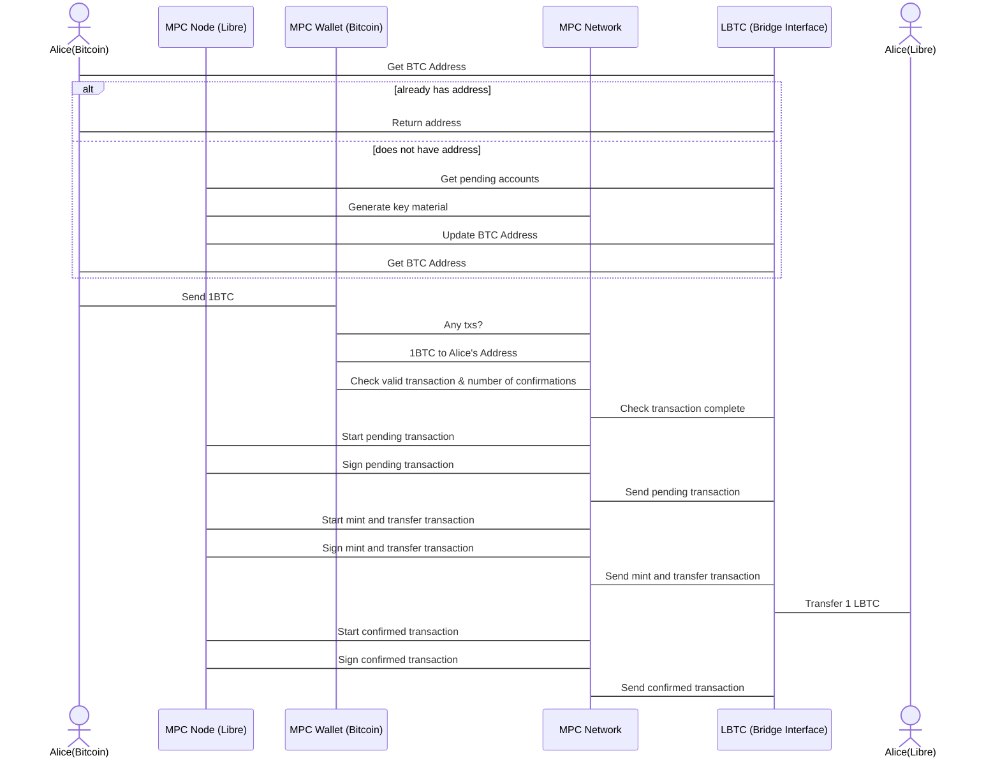

# Pegin

```mermaid
sequenceDiagram
  actor Alice(Bitcoin)
  participant MPC Node (Libre)
  participant MPC Wallet (Bitcoin)
  participant MPC Network
  participant LBTC (Bridge Interface)
  actor Alice(Libre)

  Alice(Bitcoin)->LBTC (Bridge Interface): Get BTC Address
  alt already has address
    LBTC (Bridge Interface)->Alice(Bitcoin): Return address
  else does not have address
    MPC Node (Libre)->LBTC (Bridge Interface): Get pending accounts

    MPC Node (Libre)->MPC Network: Generate key material
    MPC Node (Libre)->LBTC (Bridge Interface): Update BTC Address
    Alice(Bitcoin)->LBTC (Bridge Interface): Get BTC Address
  end

  Alice(Bitcoin)->MPC Wallet (Bitcoin):Send 1BTC 
  
  MPC Network->MPC Wallet (Bitcoin): Any txs?
  MPC Wallet (Bitcoin)->MPC Network: 1BTC to Alice's Address
  MPC Network->MPC Wallet (Bitcoin): Check valid transaction & number of confirmations
  MPC Network->LBTC (Bridge Interface): Check transaction complete

  %% Insert pending transaction   
  MPC Network->MPC Node (Libre): Start pending transaction
  MPC Network->MPC Node (Libre): Sign pending transaction
  MPC Network->LBTC (Bridge Interface): Send pending transaction

  %% Insert mint transaction   
  MPC Network->MPC Node (Libre): Start mint and transfer transaction
  MPC Network->MPC Node (Libre): Sign mint and transfer transaction
  MPC Network->LBTC (Bridge Interface): Send mint and transfer transaction

  LBTC (Bridge Interface)->Alice(Libre): Transfer 1 LBTC

  %% Insert confirmed transaction   
  MPC Network->MPC Node (Libre): Start confirmed transaction
  MPC Network->MPC Node (Libre): Sign confirmed transaction
  MPC Network->LBTC (Bridge Interface): Send confirmed transaction
```
